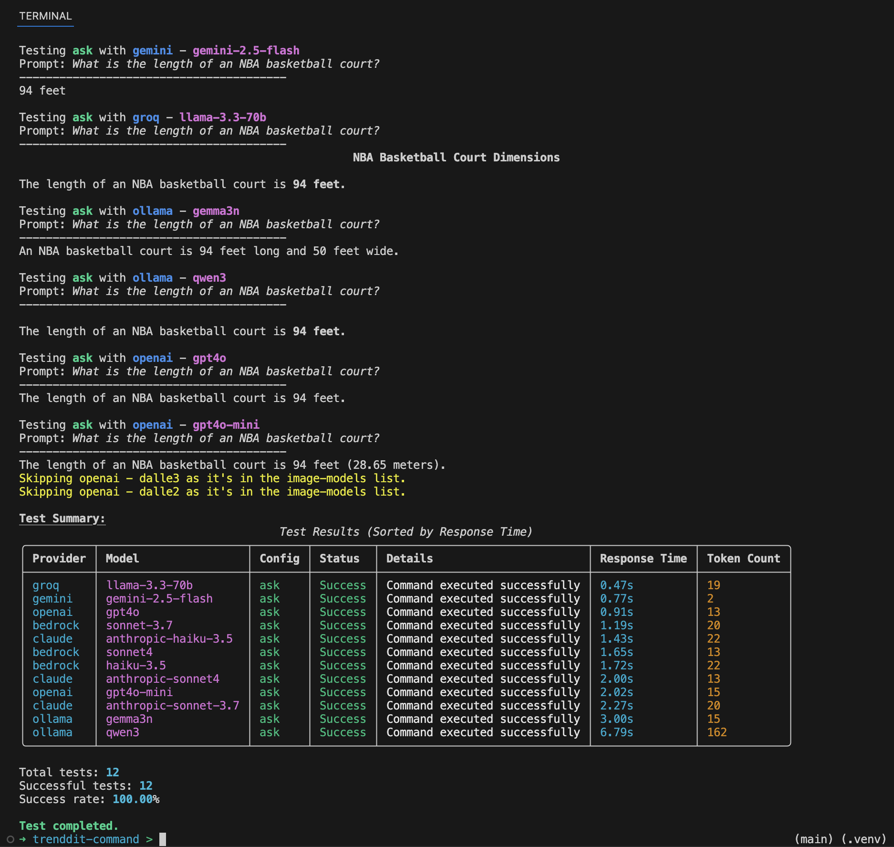
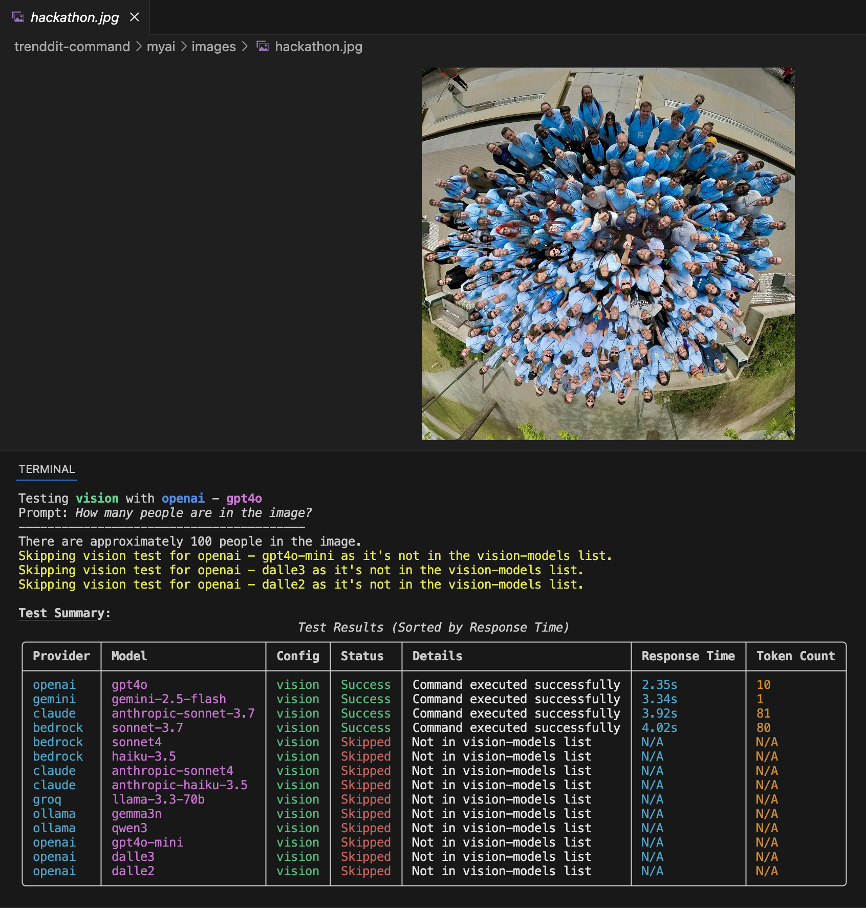

# 🚀 Trenddit Command

<p align="center">
  
  
  
  
</p>

<p align="center">
  <b>Your Terminal. Your AI. Your Control.</b><br>
  Unified access to 15+ LLMs from Claude, GPT-4, Gemini, and more - all from your command line.
</p>

---

## ✨ Why Trenddit?

Transform your terminal into a powerful AI workstation. No browser tabs, no context switching - just pure productivity with the models you trust.

```bash
ask "explain quantum computing in simple terms"
# Instant streaming response with beautiful markdown formatting
```



## 🎯 Key Features

- **🤖 15+ Models, 7 Providers** - Claude, GPT-4, Gemini, Llama, Mistral, and more
- **⚡ Blazing Fast** - Streaming responses with rich terminal UI
- **📝 Markdown Native** - Seamless integration with Obsidian, VS Code, and GitHub
- **🖼️ Vision & Image Gen** - Analyze images and create stunning visuals
- **🔒 Privacy First** - Run local models with Ollama or use trusted providers
- **📊 Built-in Analytics** - Track usage, costs, and performance trends
- **🔧 Fully Configurable** - One YAML file controls everything

## 🚀 Quick Start

```bash
# Install Trenddit
pip install -U trenddit-command

# Initialize in your project
tc init

# Start using AI
ask "How do I implement a binary search tree?"
```

### 🔑 Set Up Your Models

Add your API keys to `~/.zshrc` or environment:

```bash
export ANTHROPIC_API_KEY=your_key_here
export OPENAI_API_KEY=your_key_here
export GROQ_API_KEY=your_key_here
export GEMINI_API_KEY=your_key_here
```

For local models, [install Ollama](https://ollama.com/) and pull your favorite models.

## 💡 Core Commands

### Ask Anything
```bash
ask "write a Python function to calculate fibonacci"
```

### Generate Images
```bash
image "a serene Japanese garden at sunset, oil painting style"
```

### Analyze Images
```bash
tc vision -p screenshot.png "what's wrong with this UI?"
```



### Expand Your Content
```bash
refer post-to-update "my-blog-draft"
# Transforms drafts into polished content
```

## 🛠️ Advanced Features

### 📈 Compare Models Side-by-Side
```bash
# Terminal 1
tc config ask model sonnet
ask "explain REST APIs"

# Terminal 2  
tc config ask model gpt4o
ask "explain REST APIs"
```

### 🧪 Test All Models
```bash
tc test ask      # Test text models
tc test vision   # Test vision capabilities
```

### 📊 Track Performance
```bash
tc trends --days 7  # Visualize latency and token usage
tc audit           # Analyze your AI usage patterns
```

### 🌐 Web Scraping
```bash
tc gather "https://example.com/article"
# Clean markdown extraction with images
```

### 🚀 Generate & Run Apps
```bash
ask "create a React todo app with Tailwind"
tc run  # Sets up and launches the app
```

## 🎨 Markdown Workflows

Trenddit integrates seamlessly with your favorite tools:

- **📝 Obsidian** - Build a second brain with AI assistance
- **💻 VS Code** - Enhance your coding with inline AI
- **🐙 GitHub** - Generate documentation and READMEs

### Intent-Driven Workflows
```yaml
# Define intents in markdown
## Financial Analysis
### Macro Factors Impact Stocks
### Top Companies by ROCE

# Expand with AI
tc intents "Financial Analysis"
```

## ⚙️ Configuration

Everything is controlled by `trenddit-command.yml`:

```yaml
# Model shortcuts
model-mapping:
  sonnet: claude-3-5-sonnet-20240620
  gpt4o: gpt-4o
  llama: llama3.1

# Command defaults  
ask:
  provider: claude
  model: sonnet
  max-tokens: 300
  temperature: 0.7
```

## 🏗️ Project Structure

```
myai/
├── prompts/       # Reusable prompt templates
├── intents/       # Intent-based workflows  
├── code/          # Generated applications
├── gather/        # Scraped web content
├── images/        # AI-generated images
├── embeds/        # Expanded content
└── metrics/       # Performance data
```

## 🧑‍💻 Development

### Using Poetry (Recommended)
```bash
git clone https://github.com/yourusername/trenddit-command
cd trenddit-command
poetry install
poetry shell
tc init
```

### Running Tests
```bash
poetry run pytest
poetry run pytest --cov  # With coverage
```

### Code Quality
```bash
poetry run black .
poetry run isort .
poetry run pylint src/
```

## 🤝 Contributing

We love contributions! Please see our [Contributing Guide](CONTRIBUTING.md) for details.

1. Fork the repository
2. Create your feature branch (`git checkout -b feature/amazing-feature`)
3. Commit your changes (`git commit -m 'Add amazing feature'`)
4. Push to the branch (`git push origin feature/amazing-feature`)
5. Open a Pull Request

## 📚 Documentation

- [Full Documentation](https://trenddit-command.github.io)
- [API Reference](docs/api.md)
- [Configuration Guide](docs/configuration.md)
- [Provider Setup](docs/providers.md)

## 🌟 Show Your Support

Give a ⭐️ if this project helped you!

## 📄 License

This project is [MIT](LICENSE) licensed.

---

<p align="center">
  Made with ❤️ by the Trenddit Community<br>
  <a href="https://twitter.com/trenddit">Twitter</a> •
  <a href="https://discord.gg/trenddit">Discord</a> •
  <a href="https://github.com/trenddit-command/trenddit-command">GitHub</a>
</p>