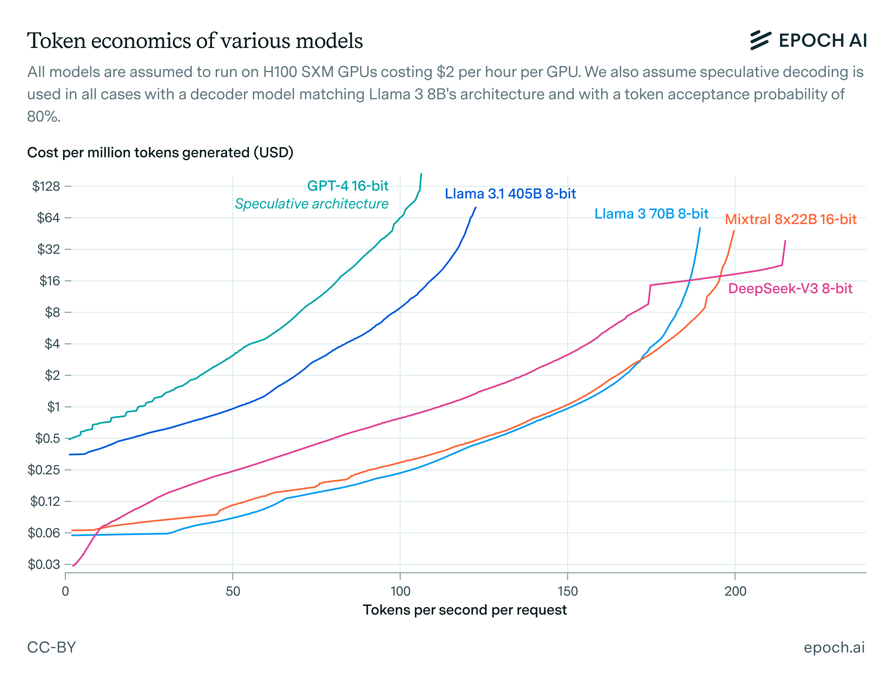

As the capabilities of AI models have expanded, and as the recent paradigm of test-time compute scaling has taken off, the demand for AI inference has grown enormously. [Inference revenue at major AI companies](/data-insights/ai-companies-revenue) such as OpenAI and Anthropic has been growing at a rate of 3x per year or more, even as their models continue to become [smaller](/gradient-updates/frontier-language-models-have-become-much-smaller) and [cheaper](/data-insights/llm-inference-price-trends) compared to 2023.

A few years ago, the benchmark for whether a language model was fast enough was “human reading speed”: if a model could generate 10 tokens per second when responding to a user, that was good enough. Now, as models are asked to reason at length about complex problems and are placed inside elaborate agentic loops, this benchmark has become obsolete. The benefits to serving models faster for inference are greater than ever before. Despite this, there has been little work investigating how language models can be served quickly at scale and how much we can increase their speed at the expense of paying a higher price per token.

Today, we’re releasing a model of LLM inference economics which helps answer these questions. Working with the model reveals many important facts about inference at scale that are not widely appreciated.

## How does the model work?

The basic idea behind the model is to decompose the time taken during the forward pass of a Transformer into four components:

  * **Arithmetic time** , which is the time taken by the cores of a GPU to perform the actual addition and multiplication operations.
  * **Memory read-write time** , which is the time needed to load information from high-bandwidth memory (HBM) into the cores. A more detailed approach would model the entire memory hierarchy instead of just HBM, but we don’t do this.
  * **Network send-receive time** , which is computed by dividing the amount of information each GPU receives by its receive-only network bandwidth.
  * **Latency** , which is the fixed time taken up by operations such as kernel launches and GPU collectives independent of their size. For example, the NVIDIA Collective Communication Library (NCCL)’s LL128 protocol for an all-reduce has a base latency of 30 microseconds on a DGX H100 machine, even if we’re using it to reduce a tensor whose size is only one byte.

For a given Transformer architecture and a setup for parallelizing its inference across multiple GPUs, we can use this decomposition to compute how fast we can do a forward pass on specific inputs, assuming we know the past context length and the batch size. It’s not as straightforward as directly summing all four components, because e.g. memory read-write time can be overlapped with arithmetic time, so we make reasonable assumptions about which of these can be overlapped with which of the others to end up with a final answer.

We can then perform a grid search over all possible inference setups for a given model architecture and determine the ones that achieve the best possible speed for fixed cost, or equivalently lowest possible cost for a fixed speed. Connecting all these points tells us how we can optimally trade off speed against cost when serving models for inference. In other words, it gives us the _Pareto frontiers_ of inference economics.

## Some takeaways from the model

**Network latency is a critical bottleneck to fast LLM inference.** Though network _bandwidth_ limits are discussed more often, they only become dominant when we’re using GPU collectives over tensors larger than 10 MB. With a model dimension of 10K and 16-bit activations, this requires per-GPU batch sizes of 500 or larger, and there’s no reason to ever use batch sizes so large for fast inference. As a result, network communication time in fast inference is dominated by _latency_ , not by _bandwidth_.

If we didn’t have to worry about latency constraints, we could indefinitely quadruple inference speed for each doubling of cost per token by parallelizing a forward pass across more GPUs, as observed previously by [Steinhardt (2022)](https://bounded-regret.ghost.io/how-fast-can-we-perform-a-forward-pass/). So the fact that latency constraints are binding in practice is crucial for understanding why LLMs are not served much faster than they currently are.

**The token generation speed at which a dense Transformer can be served for inference scales roughly with the inverse square root of its parameter count, and with the cube root of the memory bandwidth of the GPUs used to serve the model.** These rough scaling laws not only appear to work well empirically, but also can be derived from a toy model which assumes infinite network bandwidth but nonzero network latency. While they are far from exact, they are useful for rough “order of magnitude” comparisons of inference speed.

**In practice, the only reason to use pipeline parallelism over data parallelism is to fit a large model into GPU high-bandwidth memory.** This is because if we have a pipeline with a certain number of stages, we need to slice our batch into that many smaller pieces in order to keep all stages of the pipeline active and avoid bubbles. So most of the time pipeline parallelism just becomes a worse version of data parallelism due to the extra communication needed between successive pipeline stages.

Because pipeline parallelism is only useful when memory limits bind, it’s only useful when our decoding speed is slow. More precisely, if a model is being served faster than the time it would take to read the entire content of a GPU’s high-bandwidth memory, in general it will be inefficient to serve it using pipeline parallelism. For the H100, this speed is theoretically around (80 GB)/(3.3 TB/s) = 24 ms/token, or 42 tokens/second.

**Speculative decoding can double the speed of inference with large models without increasing costs or decreasing performance.** Though speculative decoding doesn’t help with arithmetic and network bandwidth costs, in fast decoding these costs are not binding. Instead, inference speed is bound by memory bandwidth and network latency, both of which are amortized over multiple tokens if we use speculative decoding to generate many tokens in one forward pass of a large model. Empirically, the effect size can be as large as a doubling of token generation speed at fixed cost.

## Conclusion

Language model inference at scale has been an opaque subject until now, with little reliable research published about it so far even as reasoning models and AI agents have been making cheap and fast inference increasingly more important. We hope that this work will help improve public understanding of the topic and clear up popular misconceptions.
